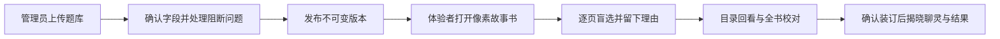
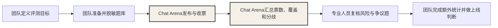

# Chat Arena文档导航

Chat Arena现在解决的是一件很具体的事：**把同一道题的两条回复放进一本可翻阅的像素互动书，让体验者盲选、回看、校对，再把票按题库版本保存和汇总。**

它已经能用于真实内测，但还不能产出模型榜，也不能直接给出「哪个模型该上线」的结论。

## 30 秒看懂当前版本

当前版本能证明到这里：

> 在某一版题库、某一批具体样本里，多少成员做了什么选择，哪些题分歧最大。

当前版本不能继续往下推：

> 模型 A 综合能力强于模型 B，所以应该上线。

后一个结论还缺模型级统计、置信区间、代表性测试蓝图、质量控制和安全闸门。现在没有，就不装作有。

## 文档怎么读

| 你现在要做什么 | 直接读 | 文档性质 |
| --- | --- | --- |
| 实现下一阶段互动图鉴与可玩 Demo | [08-ChatArena体验重构规范](./08-ChatArena体验重构规范.md) | 当前唯一有效的体验、前端与交互方案 |
| 了解当前产品到底做了什么 | [06-真实内测版](./06-真实内测版.md) | 当前事实 |
| 参加评测或管理题库 | [07-使用手册](./07-使用手册.md) | 当前操作手册 |
| 理解最初的产品方向 | [01-产品方案](./01-产品方案.md) | 历史研究稿 |
| 研究未来怎样做可信模型评分 | [02-评分机制](./02-评分机制.md) | 后续方案 |
| 了解现有 XLSX 的数据质量 | [03-素材盘点](./03-素材盘点.md) | 原始数据盘点 |
| 看外部产品带来了哪些判断 | [04-调研与借鉴](./04-调研与借鉴.md) | 研究材料 |
| 看早期两周落地设想 | [05-落地路线](./05-落地路线.md) | 历史路线 |

阅读优先级很明确：**06 和 07 是当前已上线口径；《08-ChatArena体验重构规范》是下一阶段唯一规划口径。旧版《08-互动图鉴Demo计划》只保留作讨论记录，不再作为实现依据。01–05 与它们冲突时，以 06、07 和新 08 为准。**

## 当前能力边界

| 已经能做 | 还不能做 |
| --- | --- |
| 导入 XLSX / CSV 题库 | 在线生成候选回复 |
| 自动建议字段映射并人工确认 | 自动判断题库是否代表业务 |
| 匿名 A/B 四选一投票 | Elo、BT、置信区间和模型排名 |
| 稳定换位、一人一题一票 | 自动识别低质量或恶意投票 |
| 版本隔离、发布和回滚 | 撤回已提交的胜负票 |
| 汇总票数、覆盖和争议题 | 自动给出模型上线结论 |

## 一次内测的责任分界

Chat Arena负责中间这段：题库发布、盲评收票、版本隔离和基础汇总。

题库是否合格、风险内容是否安全、结果是否足以支持上线，仍然要由团队负责。工具把证据收好，但不会替人做超出证据的判断。
