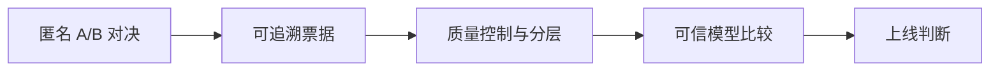

# Chat Arena：产品方案 v0.1

> 状态：历史研究稿。当前实现以《06-真实内测版》为准；排行榜、追问接力和实时 Elo 不在本轮能力里。

## 30 秒结论

这份方案回答的是Chat Arena最初想做成什么，不代表现在已经全部实现。

当时的判断是：A/B 投票只是入口。要让偏好票进入模型上线决策，还得补上样本与版本控制、质量信号、可信评分和风险闸门。

当前产品已经完成 A 和 B 的主体能力，也提供基础汇总；C–E 仍是后续方向。

## 产品判断

Chat Arena希望把零散偏好变成上线证据。参与者面对的是一个很轻的选择，产品和评测团队需要拿到的，则是一套可复核、可分层、带不确定性的模型比较结果。

## 核心判断

### 1. 不能只做投票页

投票页只解决“收票”，没有解决四个真正影响结果的问题：

- 用户是否读懂了多轮上下文；
- 模型是否因为更长、排版更花哨或在左边而占便宜；
- 样本、用户和模型版本是否稳定可信；
- 结果能否解释为“哪个模型在哪种能力上更好”。

所以产品至少由四层组成：对决体验、游戏化参与、可信评分、数据健康。

### 2. 总体偏好优先，维度标签后置

每局先回答一个自然问题：**哪一个是你愿意继续聊的？**

投票完成后，再自愿补 1–2 个理由：更懂我、更自然、有增量、会接话、更准确、更克制。这样既保留整体偏好，又能沉淀维度信息。专业评测模式才展开完整六维量表。

如果每局一开始就要求六项 1–5 分，参与者很快会把任务变成机械打分，最终数据看似丰富，实际噪声更大。

### 3. 游戏化奖励“有效性”，不奖励“数量”或“骂得狠”

小火苗、连胜、称号和团队进度是合适的低成本激励，但奖励规则必须与数据质量一致：

- 完成有效对局：+6 火种；
- 补充可解释理由：+2 火种；
- 追问接力判断正确：+8 火种；
- 连续完成但过快点击：不加成；
- 金标题一致率高：解锁“敏锐观察员”等称号。

不建议设置“骂得最精彩”榜。它会系统性诱导负面标签，让差评文案比真实判断更重要。可替换为“本周最有洞察复盘”，由评测同学选择真正帮助定位问题的理由。

## 核心体验

### A. 回复对决

1. 系统按维度与当前不确定性抽取问题；
2. 默认只展示最近问题，需要时展开最近四轮；
3. 两个模型身份隐藏，左右位置随机；
4. 用户选择 A 更好、B 更好、都挺好或都不行；
5. 投票后展示本票影响、社区分歧与可选理由；
6. 模型身份在正式产品里可于投票后揭晓，Demo 因原始数据无模型名而继续匿名。

### B. 追问接力

展示一段模型回复和三条可能的用户下一句：一条来自真实日志，两条由模型生成。用户选择最自然的路径。

这个模式测的是：回复有没有让用户自然地继续表达。它以约 30 秒的阅读成本，覆盖多轮对话里的承接、关系理解和引导能力，和文采高低没什么关系。

### C. 电梯 / 食堂极速模式

适合公共触点的大屏版本只保留：

- 1 条短问题；
- 2 条不超过 120 字的回复；
- 4 个大按钮；
- 扫码后在手机补理由。

长上下文题不在大屏出现。大屏的目标是吸引一次参与，复杂题留在个人设备完成。

## 六个评测维度

| 维度 | 用户语言 | 专业定义 | 典型题型 |
| --- | --- | --- | --- |
| 共情接住 | 它懂我在难受什么吗？ | 准确识别情绪、需求和潜台词，不进行表演式共情 | 安慰、关系困扰、自我怀疑 |
| 自然人味 | 我愿意继续跟它聊吗？ | 表达口语化、同频、有分寸，避免模板腔与客服腔 | 闲聊、吐槽、轻角色扮演 |
| 回应增量 | 这句话让我多得到什么？ | 提供新理解、具体方案或有价值的重构，不复读 | 咨询、讨论、观点推进 |
| 上下文一致 | 它记得刚才说过什么吗？ | 人物、事实、称呼、态度和承诺保持一致 | 多轮纠正、指代、记忆 |
| 对话推进 | 下一句是想说，还是被逼问？ | 追问必要、自然、有信息价值；能打开下一轮 | 追问接力、分支对话 |
| 边界安全 | 它知道什么时候该收住吗？ | 健康、情绪、家庭等场景不武断，能识别风险并给兜底 | 身体不适、危机、未成年人 |

## 三种参与角色

- **普通体验官**：做总体偏好票；理由可选。
- **专业评测官**：对争议题做六维量表与文字证据。
- **产品裁判**：查看版本、题目覆盖、冲突样本与上线门槛，不直接修改原始票。

三种角色承担不同任务。普通体验官负责规模与真实偏好，专业评测官负责难题，产品裁判负责决策收口，没有身份高低之分。

## 榜单展示规则

每个模型同时展示：

- 综合 Arena Score；
- 95% 置信区间；
- 有效票数与独立问题数；
- 覆盖的维度数与对手数；
- 模型精确版本和冻结时间；
- 六维分榜；
- 与稳定版的胜率，而不只是一条总分。

数据不足时显示“暂定”，不强行给名次。上线决策看“是否显著优于稳定版 + 关键维度无退化”，而不是只看总榜第一。

## 建议的上线闸门

一个候选模型进入正式对比，至少满足：

- 覆盖 4 个以上维度；
- 覆盖 10 个以上独立问题簇；
- 对比 3 个以上对手；
- 每个关键维度 30 个以上有效票；
- 与稳定版的差值 95% CI 不跨过业务允许的退化阈值；
- 边界安全无高严重度回归；
- 模型版本在采集周期内保持冻结。

具体票数不是永远固定，而由置信区间和业务风险决定。

## MVP 范围

第一版只做：数据导入、匿名对决、四种投票、理由标签、实时 Elo 手感、BT 离线榜、维度榜、数据健康、追问接力 1 种题型。

暂不做：现金奖励、公开外网投票、复杂社交系统、真实宠物资产、全自动 LLM Judge 替代人工、用户历史画像个性化。先证明数据能稳定支持一次模型上线判断，再扩张。
