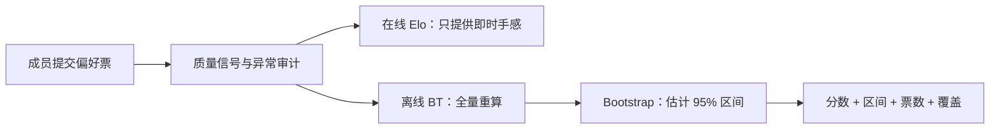

# 评分机制：即时有手感，正式要可信

> 状态：后续研究稿。真实内测版只汇总有效票，不计算或展示 Elo、BT 排名。

## 30 秒结论

当前产品没有评分系统。这份文档记录的是未来真要做模型榜时，分数应该怎么分工。

- 在线 Elo 负责即时反馈，不能直接当正式结论；
- Bradley–Terry 负责全量重算模型差异；
- Bootstrap 给出不确定性；
- 票数、覆盖、偏差和版本信息必须和分数一起展示。



如果只做一条会动的分数线，页面会很热闹，证据仍然不够。

## 1. 为什么不把在线 Elo 直接当正式榜

在线 Elo 的优点是每一票立刻看到变化，适合游戏化；缺点是结果与对局顺序、K 值、模型加入时间有关，而且很难自然给出可靠的置信区间。

因此采用两层机制：

- **体验层：在线 Elo**，让参与者看到“爆冷赢强敌加得更多”；
- **发布层：Bradley–Terry 最大似然估计**，批量使用全部有效票重算分数，并用 Bootstrap 给出 95% 置信区间。

这与 Chatbot Arena 从在线 Elo 转向 Bradley–Terry 的方向一致。

## 2. 在线 Elo

模型 A 对模型 B 的预期胜率：

```text
E_A = 1 / (1 + 10 ^ ((R_B - R_A) / 400))
```

一票后的变化：

```text
ΔR_A = K × w_vote × (S_A - E_A)
ΔR_B = -ΔR_A
```

- A 胜：`S_A = 1`
- 平局（都好 / 都差）：`S_A = 0.5`
- B 胜：`S_A = 0`
- 默认 `K = 24`
- `w_vote` 建议范围 0.5–1.2，只反映票据可靠性，不反映“喜欢哪个模型”

### 为什么不再乘问题难度

低分模型击败高分模型时，`E_A` 已经让爆冷方获得更大分值。如果再乘“问题很难”，同一件事会被重复放大。

问题难度应该用于：

- 保证测试蓝图里有足够难题；
- 给能力分榜分层；
- 优先抽取能区分模型的样本；
- 判断用户需要读多少上下文。

它不应该直接成为单票的任意放大器。

## 3. 正式 Bradley–Terry 分数

基础模型：

```text
P(A 胜 B) = sigmoid(θ_A - θ_B)
```

生产版本建议控制偏差：

```text
P(A 胜 B) = sigmoid(
  θ_A - θ_B
  + β_position × left_right
  + β_length × length_difference
  + β_style × markdown_difference
)
```

其中 `θ` 是模型能力，其他项用于隔离左侧位置、长度和 Markdown 风格带来的偏好。分维度时，为每个维度单独拟合 `θ_dimension`，综合分按测试蓝图预先确定权重，不能根据结果临时改权。

### 平局

MVP 可把一次平局拆成半个 A 胜和半个 B 胜。样本量增大后，建议改为 Davidson tie model，区分“两个都好”和“两个都差”的平局倾向。

### Bootstrap

至少做 1,000 次重采样，发布 2.5%–97.5% 分位区间。由于同一用户和同一问题会产生相关票，建议按**用户或问题簇做 cluster bootstrap**，不要把每一票假设成完全独立。

## 4. 票据可靠性

每张票保存以下质量信号：

- 是否为重复 UID / 重复内容；
- A/B 左右顺序；
- 页面停留时间、上下文是否展开；
- 隐藏金标题正确率；
- 对同一对局换位后的自洽性；
- 投票者角色；
- 是否补充理由及理由是否可用；
- 设备、账号和短时间重复模式。

建议权重：

```text
w_vote = clamp(0.5, 1.2,
  0.7
  + 0.2 × gold_accuracy
  + 0.2 × position_consistency
  + 0.1 × expert_role
)
```

停留时间只用于识别极端异常，不应因为“读得快”就惩罚熟练评测者。异常票先降权并进入审计，不轻易永久封禁。

## 5. 问题难度与主动抽样

问题难度不是“人类分歧越大越难”。50/50 也可能只是两个回答同样平庸或题目本身含糊。

建议难度由四部分构成：

- 上下文长度与依赖深度；
- 是否包含隐含关系、角色或纠错；
- 专家预标难度；
- 历史上该题对模型的可分离度。

主动抽样优先级：

```text
priority =
  0.35 × ranking_uncertainty
  + 0.30 × pair_closeness
  + 0.20 × dimension_undercoverage
  + 0.15 × version_freshness
```

优先比较分数接近、区间宽、覆盖不足的模型对。避免一直让榜首打榜尾，因为这些票几乎不再提供新信息。

## 6. 最小展示门槛

模型进入综合榜前建议满足：

- 100 个以上有效票；
- 30 个以上独立问题；
- 3 个以上对手；
- 4 个以上维度；
- 最大单一问题簇不超过总票量 15%；
- 左右位置近似均衡；
- 模型版本和系统提示在采集期内冻结。

若不满足，不隐藏数据，但明确显示“暂定”和缺口。

## 7. 推荐事件结构

```json
{
  "battle_id": "uuid",
  "query_id": "uuid",
  "dimension": "empathy",
  "difficulty": 3,
  "model_a": "provider/model@version",
  "model_b": "provider/model@version",
  "position_seed": "hash",
  "winner": "a|b|tie_good|tie_bad",
  "reason_tags": ["natural", "incremental"],
  "rater_id": "hashed-id",
  "rater_role": "employee|expert|product",
  "dwell_ms": 18400,
  "context_opened": true,
  "created_at": "ISO-8601"
}
```

模型名称在前端投票前隐藏，但服务端必须保留精确 provider、模型版本、系统提示版本和生成参数，否则分数不可复现。
