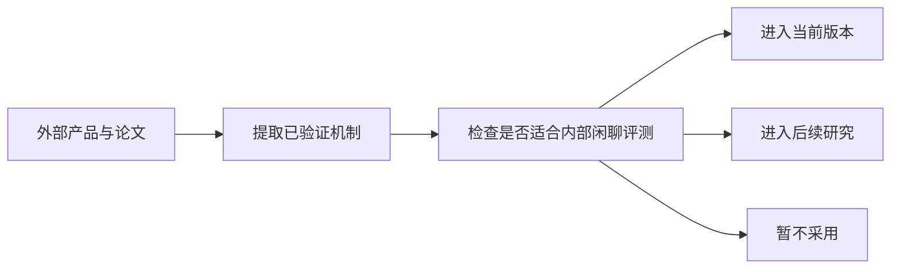

# 外部调研与可借鉴实现

> 状态：研究材料，不代表当前已实现能力。真实内测版不使用 Elo、BT 排名或追问接力。

## 30 秒结论

这轮调研最后留下了四个产品判断：匿名并排比较值得用；正式排名必须带不确定性；单轮和多轮任务要分开；自动 Judge 和模拟用户只能当信号，不能当真值。

当前版本只落了其中最稳的一层：匿名 A/B、稳定换位、四选一、版本隔离和真实票据汇总。BT、主动抽样、追问接力和模拟用户仍是后续研究。

下面保留当时的调研记录。里面的「对本项目的转化」是方向，不等于已经上线。

## 1. LMSYS / Chatbot Arena

### 借鉴

- 匿名并排比较比单独 1–5 分更适合开放式回答；
- 从在线 Elo 转为 Bradley–Terry 最大似然估计，可以得到更稳定的排名与更准确的置信区间；
- 新模型票少时，置信区间自然更宽，应直接展示而不是隐藏；
- 主动抽样能减少达到同等精度所需的票；
- 需要识别异常用户与重复、无意义输入；
- 长度、Markdown、左右位置都会影响偏好，需控制。

### 对本项目的转化

前台保留 Elo 手感，后台正式榜改用 BT；榜单同时展示分数、95% CI、票数与覆盖；抽题优先比较分数接近或区间宽的模型。

来源：

- https://www.lmsys.org/blog/2023-12-07-leaderboard/
- https://arxiv.org/abs/2403.04132
- https://www.lmsys.org/blog/2024-08-28-style-control/
- https://github.com/lm-sys/FastChat

## 2. Arena-Hard-Auto

### 借鉴

它把榜单质量拆成两个问题：能不能高置信地区分模型，以及是否与真实人类偏好一致。仅看 Spearman 排名相关性不够，因为它没有告诉你模型差异是否显著。

### 对本项目的转化

后台新增：

- 可分离模型对比例；
- 与专家金标一致率；
- 人工 / Judge / Reward 冲突队列；
- 长度与 Markdown 风格控制。

来源：https://github.com/lmarena/arena-hard-auto

## 3. Lone Arena

### 借鉴

它把评测压缩到非常明确的动作：一次看一场，用快捷键选择胜者。这证明专业工具不一定需要复杂表单，速度来自任务边界清楚。

### 对本项目的转化

Demo 支持键盘 1 / 2 / 3 / 4；一次只判断一个问题；完整六维量表只给专家任务，不把普通参与者变成填表员。

来源：https://github.com/Contextualist/lone-arena

## 4. Google Litmus

### 借鉴

它区分单轮 Test Run 与多轮 Test Mission，并把测试模板、执行、结果和筛选分开。这说明单轮与多轮不应被塞进同一种题面。

### 对本项目的转化

Chat Arena将“回复对决”和“追问接力”作为两个模式：前者判断单个回答，后者判断完整对话的下一步。

来源：https://github.com/google/litmus

## 5. Microsoft SimulatorArena

### 借鉴

它使用真实人机对话与带用户画像的模拟器评测多轮助手，同时保留对模拟器本身可靠性的评估。模拟用户不是天然真值，也需要与真实用户对齐。

### 对本项目的转化

后续可以接入模型生成的两条候选追问，但必须混入真实日志追问作为锚点，并持续统计参与者能否识别自然路径。

来源：https://github.com/microsoft/SimulatorArena

## 6. Google / Open-source eval 工具的共同趋势

Google Litmus、TensorZero、Giskard、DeepEval 等工具都在把评测从“单一总分”扩展到可复现测试、分维度指标、多轮流程与回归检测。对内部产品更有价值的落点，是让 Arena 进入模型上线流程，成为一道有明确证据要求的闸门。

参考：

- https://github.com/tensorzero/tensorzero
- https://github.com/Giskard-AI/giskard-oss
- https://github.com/confident-ai/deepeval

## 最终取舍

### 采用

- 盲测并排比较；
- 总体票 + 可选理由；
- BT 正式分 + Bootstrap CI；
- 位置 / 长度 / 风格控制；
- 主动抽样；
- 多轮独立题型；
- 金标题与异常票降权；
- 版本冻结和覆盖门槛。

### 暂不采用

- 直接把 LLM Judge 当最终裁判；
- 用题目难度重复放大 Elo；
- 只看一条总榜；
- 现金按票数结算；
- 让普通参与者每局填写完整六维表；
- 在模型名、版本和生成参数缺失时发布真实榜。
