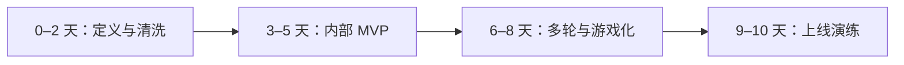

# 落地路线：两周做出能支持一次上线决策的版本

> 状态：历史路线。当前交付以《06-真实内测版》为准。

## 30 秒结论

这是一份早期两周冲刺设想，不是当前排期。它把工作拆成四段：先把数据和口径锁住，再做收票工具，然后补多轮与质量机制，最后才跑上线演练。

当前完成的是内部 MVP 里和真实收票直接相关的部分：上传、预检、盲评、版本、票据和基础结果。Elo / BT、追问接力、游戏化和正式上线闸门还没有完成。

因此这份路线更适合拿来判断「后面缺什么」，不适合拿来汇报「现在有什么」。

## 第 0–2 天：定义与清洗

- 锁定六维测试蓝图与上线闸门；
- 工作簿去重、补 query_id、模型名、版本与生成参数；
- 从近期 RN 数据中各选 30–50 个问题簇；
- 高风险题由评测同学预标边界与严重度；
- 明确 IdeaTalk 或外部模型接口的输入输出协议。

交付物：数据字典、首批题库、模型清单、评分口径。

## 第 3–5 天：内部 MVP

- 接入真实 A/B 生成结果；
- 实现盲测、换位、四种投票和理由标签；
- 记录停留时长、上下文展开、位置种子和版本；
- 建立实时 Elo、离线 BT 和 Bootstrap 报表；
- 数据健康台加入重复、缺字段与冲突检查。

交付物：30 人可用的内测链接、第一版榜单。

## 第 6–8 天：多轮与游戏化

- 上线追问接力；
- 接入真实用户后续作为锚点；
- 小火苗、连续参与、团队目标和专业评测称号；
- 增加隐藏金标题和一致性题；
- 做电梯 / 食堂的短题大屏版，扫码进入手机补理由。

交付物：两种评测模式、参与增长机制、质量权重。

## 第 9–10 天：上线演练

- 选一个内部候选模型、一个稳定版、GPT / Gemini 外部基线；
- 冻结模型版本和提示；
- 跑满预设覆盖门槛；
- 审核争议题与安全回归；
- 输出“是否上线、在哪些维度上线、风险是什么”的决策页。

交付物：一次完整上线评审材料。

## 团队协作建议

会议里提出“每个人做完整 Demo”在发散期是有效的，但到收敛期需要一个统一契约，避免最后只能拼视觉亮点：

- 所有 Demo 使用同一份数据字典；
- 投票结果枚举一致；
- 模型版本与位置种子必填；
- 评分输出同时包含 point estimate、CI、票数与覆盖；
- 每个 Demo 必须回答“普通票怎样进入上线决策”。

下周评审不按页面数量打分，按四项选亮点：参与效率、数据可信度、多轮有效性、上线决策可用性。

## 需要团队当场敲定的四件事

1. 六维权重，尤其是闲聊场景里共情、增量与安全的优先级；
2. 哪些内部模型和外部基线进入首轮，精确到版本；
3. 上线门槛是“显著胜过稳定版”还是“非劣 + 关键维度提升”；
4. RN 数据能否用于内部评测、需要怎样的脱敏与权限控制。
