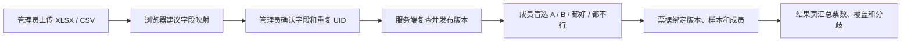
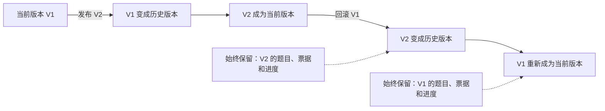

# 真实内测版：当前产品口径

> 这是当前实现的事实基线。其他文档与这里冲突时，以这里为准。

Chat Arena已经从静态 Demo 变成可以真实上传题库、多人投票、保留历史的内部评测工具。

但边界也很清楚：**这一版负责收集可追溯的偏好证据，不负责生成模型排名，更不直接决定模型是否上线。**

## 当前闭环

这条链路已经跑通，而且每一步都能追回去。

## 四个已经落地的判断

### 1. 数据缺口必须露出来

必填字段缺失、JSON 错误会阻断发布。重复 UID 默认保留第一条，但管理员必须确认。

模型 ID、维度和难度缺失时可以发布，系统只提醒，不补猜。空值比假结论更可靠。

### 2. 发布的是版本，不是覆盖

每次发布都会生成一个不可变版本。之后的题目、票据和个人进度都绑在这个版本上。

回滚只是切换当前版本，不删除任何已经发生的评测，也不会把两个版本的票混在一起。

### 3. 投票前只给判断需要的信息

成员看到问题、最近的必要上下文和稳定换位后的 A/B 回复。

模型身份、人工倾向和扩展元数据不会在投票前下发。投票成功后，如果原始数据提供了人工倾向，页面才显示它。

### 4. 结果只说数据已经证明的事

结果页展示：

- 有效票数；
- 参与人数；
- A / B / 都好 / 都不行分布；
- 维度覆盖；
- 至少有 2 票且存在不同选择的争议题。

当前不做 Elo、Bradley–Terry、置信区间或模型榜。即使题库补齐模型 ID，这一版仍然不会排名。

## 能力边界

| 可以据此表达 | 不能据此表达 |
| --- | --- |
| 「V1 收到 1200 张有效票」 | 「模型 A 的综合能力更强」 |
| 「这批样本里 A 被选择得更多」 | 「A 的真实业务胜率更高」 |
| 「这 8 道题分歧最大」 | 「这些题一定更难」 |
| 「当前题库缺少 30% 的维度标注」 | 「未标注样本属于某个推断维度」 |

排行榜、追问接力、实时 Elo、游戏化和自动上线结论都属于研究方向。要重新启用，先补齐数据结构、质量控制、有效票量和独立验收标准。没有这四件事，功能做出来也只是看起来完整。
