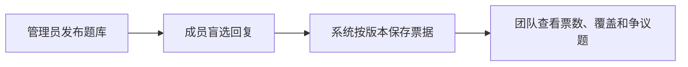
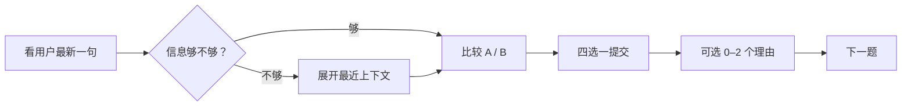
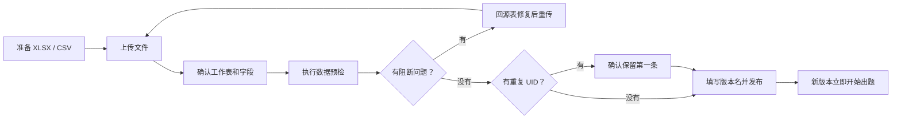
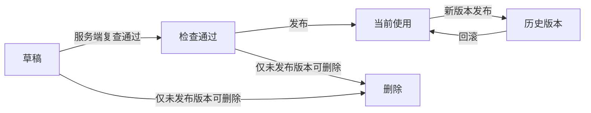
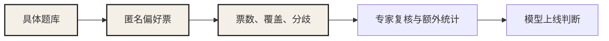

# Chat Arena使用手册

> 适用版本：像素故事书 V3.1
>
> 最后更新：2026-08-26
>
> 这份手册只写当前已经实现的能力。模型榜、Elo / BT、追问接力和游戏化还没有上线。

## 30 秒看懂怎么用

Chat Arena做的是内部 A/B 聊天偏好评测。

管理员把题库发出来，成员只看问题和两条匿名回复，选自己还愿意继续聊的那个。系统把每一票绑在题库版本、样本和成员身份上，最后汇总真实票数、覆盖和分歧。



这版能回答「这批具体题里，大家怎么选」。

它不能回答「哪个模型综合能力更强，更不能直接告诉团队哪个模型该上线」。

## 两种角色，两条路径

| 角色 | 要完成的事 | 能看到什么 |
| --- | --- | --- |
| 评测成员 | 完成匿名 A/B 对决 | 当前题库、个人进度、当前版本汇总 |
| 题库管理员 | 准备、检查、发布和回滚题库 | 评测成员的全部页面，加上题库管理 |

管理员由部署环境的 `ADMIN_EMAILS` 邮箱白名单决定。看不到「题库管理」，通常是当前邮箱没有管理员权限。

---

## 评测成员：一题怎么投



### 1. 看什么

对决页会给你：

- 用户最新一句；
- 两条匿名候选回复；
- 题库提供的评测维度和难度；
- 需要时可以展开的最近上下文；
- 你的个人完成进度。

默认从最新一句开始看。称呼、事实、关系或承诺依赖前文时，再展开上下文。系统最多展示清洗后的最近 4 条 `user` / `assistant` 消息，`system` 消息不会展示。

回复很长时可以展开全文。

### 2. 怎么选

你只需要判断一件事：**如果是你，你还愿意继续跟谁聊？**

| 选择 | 判断标准 | 快捷键 |
| --- | --- | --- |
| A 更好 | A 明显更值得继续聊 | `1` |
| 都挺好 | 两条都达到可接受水平，实际差异不明显 | `2` |
| 都不行 | 两条都有明显问题 | `3` |
| B 更好 | B 明显更值得继续聊 | `4` |

长度更长、排版更花、出现在左边，都不是「更好」的证据。

### 3. 投完会发生什么

票一旦提交就会保存。同一成员在同一版本的同一道题上只保留一张票。返回已完成题目时会恢复原选择；点击「修改这一题选择」后，可以重新选择胜负与理由，系统会覆盖原票，不会重复计票。

系统会稳定决定是否交换 A/B，减少左右位置偏差。同一道题打开后不会来回换；保存时会自动映射回源表 A/B。

如果源表提供了人工倾向，它会在你投票后显示。它只是参考，不是标准答案。

### 4. 理由标签是可选项

投票后可以选 0–2 个：

- 更懂我
- 更自然
- 有增量
- 会接话
- 更准确
- 更克制

理由用于解释这张票，不改变胜负。进入下一题前可以增选或取消；回看时也可以与胜负一起修改。

系统还会记录本题停留时间、是否展开过上下文。当前只记录，不据此给票加权或扣分。

### 5. 什么时候算完成

达到本轮选择的 3、6 或 9 题后，会先进入全书校对，再装订并揭晓聊灵。新版本发布后会重新计算该版本的个人进度，旧版本的票和进度仍然保留。

---

## 题库管理员：把一版题发出来



### 1. 文件要求

- 只支持 `.xlsx` 和 `.csv`；
- 文件不超过 20 MB；
- 一版最多 500 行原始数据；
- 第一行是列名，第二行开始是数据；
- XLSX 可以有多个工作表，系统会优先选择必填字段匹配度最高的一张，管理员仍要确认。

### 2. 四个字段决定能不能发

| 标准字段 | 必填 | 内容 |
| --- | --- | --- |
| `source_uid` | 是 | 当前题库内唯一的样本 ID |
| `query` | 是 | 用户最新一句 |
| `response_a` | 是 | 原始候选回复 A |
| `response_b` | 是 | 原始候选回复 B |

任何一个字段没匹配，或者某行的值为空，发布都会被拦住。

其余字段决定结果能解释到什么程度：

| 标准字段 | 必填 | 作用 |
| --- | --- | --- |
| `messages` | 否 | 历史消息，必须是 JSON 数组 |
| `task_type` | 否 | 场景或任务类型 |
| `extra_info` | 否 | 扩展元数据，非空时必须是有效 JSON |
| `human_winner` | 否 | 原始人工倾向：A、B 或 tie |
| `model_a_id` | 否 | 模型 A 的精确标识，建议包含版本 |
| `model_b_id` | 否 | 模型 B 的精确标识，建议包含版本 |
| `dimension` | 否 | 评测维度 |
| `difficulty` | 否 | 1–5 的整数 |
| `risk` | 否 | 风险或安全标签 |

推荐直接使用标准列名。系统也能识别常见别名：

| 原始列名 | 自动映射到 |
| --- | --- |
| `uid`、`query_id`、`sample_id` | `source_uid` |
| `model_a_resp`、`answer_a` | `response_a` |
| `model_b_resp`、`answer_b` | `response_b` |
| `context`、`history` | `messages` |
| `rm_system_task_type`、`category` | `task_type` |

自动映射只是猜列名。标黄的别名字段必须人工核对，尤其别让模型 ID、回复和人工倾向错位。

### 3. `messages` 怎么写

```json
[
  {"role": "user", "content": "前一轮用户消息"},
  {"role": "assistant", "content": "前一轮助手回复"},
  {"role": "user", "content": "用户最新一句"}
]
```

系统会做四件事：

1. `human` 转成 `user`，`bot` / `model` 转成 `assistant`；
2. 只保留 `user` 和 `assistant`；
3. 如果最后一条用户消息与 `query` 完全一致，就从上下文移除，避免重复；
4. 最终只保存最近 4 条有效消息。

字段留空没问题。字段非空但不是有效 JSON，会直接阻断发布。

### 4. 预检结果怎么处理

判断顺序不要反。先处理阻断问题，再看警告。

#### 会阻断发布

- 四个必填字段没匹配；
- 必填单元格为空；
- `messages` 或 `extra_info` 不是有效 JSON；
- 文件没有有效数据；
- 原始数据超过 500 行。

这些问题没有「先发了再说」的路径。回源表修复，重新上传。

#### 只提醒，不阻断

- 缺少模型 ID；
- 缺少维度；
- 难度缺失或不在 1–5；
- 回复超过 8,000 字；
- 内容完全相同但 UID 不同。

警告不等于没影响。比如缺维度仍然能收票，但结果只能把这些样本放进「未标注」；缺模型 ID 仍然能评偏好，但无法做模型级解释。

#### 重复 UID

处理规则已经固定：**保留最先出现的一条，排除后续记录。**

管理员必须勾选确认。如果应该保留后面那条，回源表调整顺序或 UID，不要让系统替你猜。

### 5. 发布前最后确认

版本名要让团队以后还能认出来，建议写成：

> 闲聊陪伴 · 候选 0810 · 第 1 轮

点击发布后，系统会保存：

- 原始 XLSX / CSV；
- 文件 SHA-256；
- 字段映射；
- 标准化后的样本；
- 预检摘要。

新版本随后成为当前版本。之前的当前版本自动进入历史版本，旧票不会混进来。

发布中断会留下草稿。再次发布时，页面会先清理上次未完成的草稿，再重新走一遍。

---

## 版本管理：发布、历史和回滚



| 状态 | 能做什么 | 不能做什么 |
| --- | --- | --- |
| 草稿 | 继续发布或删除 | 给成员出题 |
| 检查通过 | 发布或删除 | 给成员出题 |
| 当前使用 | 给成员出题 | 修改或删除 |
| 历史版本 | 回滚为当前版本 | 修改或删除 |

三个规则要记住：

1. 已发布版本不可修改。内容要调整，就修源表、发新版本；
2. 题目、票据和个人进度始终属于产生它们的版本；
3. 回滚只切换当前版本，不删除数据，也不混票。

---

## 结果页：能看什么，别多推一步

结果页默认展示当前题库版本。

| 指标 | 它说明什么 | 它不说明什么 |
| --- | --- | --- |
| 有效票 | 当前版本成功写入的票据数 | 页面访问量 |
| 参与人数 | 按站点用户 ID 去重的人数 | 所有被邀请人数 |
| A / B / 平局分布 | 这批题的总体选择分布 | 某个模型的真实胜率 |
| 维度覆盖 | 原始 `dimension` 下有多少题和票 | 系统自动识别出的能力维度 |
| 争议题 | 至少 2 票且存在不同选择的题 | 一定更难或一定有坏票的题 |

「都挺好」和「都不行」会分开统计。它们都是平局，但产品含义完全不同：前者代表两个回复都过线，后者代表两个都需要改。

争议度按「1 − 最大选项票数占比」计算，最多展示分歧最高的 8 道题。分歧高只说明大家没有形成一致选择，适合进入专家复核，不适合直接贴「难题」标签。

当前页面不能直接切换查看任意历史版本结果。历史票据仍在后台；回滚到该版本后，页面会重新显示它的汇总。

---

## 能力边界：Chat Arena把证据收到哪一步



高亮的前三步是当前Chat Arena。后两步还要由团队完成。

### 现在能做

- 导入并标准化最多 500 行的 XLSX / CSV；
- 建议字段映射，并让管理员确认；
- 检查必填缺失、JSON、重复 UID、重复内容和部分字段缺口；
- 匿名四选一投票，稳定换位，一人一题一票；
- 记录理由、停留时间和上下文展开状态；
- 按版本隔离题目、票据和进度；
- 汇总有效票、参与人数、分布、覆盖和争议题；
- 发布不可变版本，回滚到历史版本。

### 现在不能做

- 不计算 Elo、Bradley–Terry、置信区间或显著性；
- 即使模型 ID 填齐，也不生成模型榜；
- 不自动判断题库是否代表真实业务；
- 不自动识别低质量、恶意或机器投票；
- 不给行为信号加权，也没有金标题和一致性校验；
- 不支持撤回胜负票或查看个人投票历史；
- 不做追问接力、多轮模拟、自由对话或在线生成答案；
- 不替代安全、医疗、法律等专业审核；
- 不直接给出模型上线结论。

### 结论可以说到哪里

可以说：

> 在 V1 的 120 道具体样本上，32 名内部成员提交了 2460 张有效票。A / B / 都好 / 都不行的分布为……其中 8 道题分歧较高，需要复核。

现在不能说：

> 模型 A 综合能力强于模型 B，可以上线。

后一句至少还缺精确模型版本、代表性测试蓝图、足够独立样本、质量控制、模型级统计、置信区间和关键风险审核。这些证据没补齐，票再多也不能把描述性结果包装成上线结论。

---

## 数据与隐私

「匿名」指候选模型在投票前隐藏、结果页不公开个人票据。它不表示后台不记录成员身份。

- 服务端参考实现依赖托管身份；GitHub Pages 版本只保存当前浏览器的本地投票；
- 后台保存站点用户 ID 与票据的关联，用于一人一题一票和追溯；
- 上传阶段在浏览器本地解析文件；正式发布后，原始文件进入 R2，版本、样本和票据进入 D1；
- 投票前不会下发模型 ID、人工倾向和扩展元数据；
- 结果页展示团队汇总，不展示成员姓名和个人票据；
- 系统不会自动脱敏，也不会判断源数据是否取得授权；
- 已发布版本不能通过当前页面删除。

不要上传超出内测目的所需的个人信息、账号、联系方式、商业秘密或未经授权的真实聊天原文。数据保留期限、删除请求和访问审计有明确要求时，需要部署团队另建治理流程。

---

## 常见卡点

### 看不到「题库管理」

当前邮箱不在 `ADMIN_EMAILS` 白名单。找部署负责人检查配置。

### 上传后不能继续

看预检里的阻断问题。最常见的是必填字段没匹配、必填单元格为空、JSON 错误或超过 500 行。

### 缺模型 ID 能不能发

能发，但它只是一版匿名偏好评测。当前版本无论有没有模型 ID，都不会生成模型榜。

### A/B 为什么和源表看起来相反

前台会稳定交换位置，后台保存时再映射回源表 A/B。投票后的人工倾向也会按当前页面位置显示。

### 发布新版本会不会清空旧票

不会。旧版本、旧票和旧进度都会保留，新旧版本不混算。

### 回滚会不会重新开始计票

不会。回滚后的版本会继续使用它原来保存的票据和个人进度。

---

## 一次内测怎么收口


Chat Arena完成第 4–5 步。第 1–3 步决定题库有没有资格被评，第 6–7 步决定结果有没有资格进入上线决策。

把这三段责任混在一起，最容易出现一种假完整：页面有票、结果有百分比，团队就以为结论已经成立。现在这版故意不跨那一步。
